# Dylan Express - iOS Mobile Application

<div align="center">
  


**Transforming Interprovincial Transportation in La Libertad, Peru**

[Features](#-key-features) • [Tech Stack](#️-technical-stack) • [Installation](#-installation) • [Screenshots](#-screenshots) • [Contact](#-contact)

</div>

---

## 📖 Overview

**Dylan Express** is a comprehensive iOS mobile solution revolutionizing interprovincial minivan transportation services in La Libertad, Peru. The application connects Trujillo with rural and urban communities across the region, streamlining the entire booking process while promoting sustainable local tourism development.

### 🎯 Mission

Dylan Express is dedicated to bridging the transportation gap between urban centers and highland communities, providing safe, efficient, and accessible services while fostering economic and social development through tourism promotion.

---

## ✨ Key Features

### 🎫 Smart Booking System
- **Real-time Seat Management** - Live availability updates with instant synchronization
- **Interactive Seat Selection** - Visual seat map interface for optimal user experience
- **Multi-destination Support** - Flexible routing options across La Libertad
- **Advanced Scheduling** - Precise date and time selection with calendar integration
- **Instant Confirmation** - Immediate booking verification and digital receipts

### 💳 Secure Payment Solutions
- **Yape Integration** - Seamless digital wallet payments (Peru's leading payment platform)
- **Multi-payment Options** - Card, cash, and digital payment methods
- **Automated Verification** - Real-time payment confirmation system
- **QR Ticketing** - Secure digital tickets with QR code validation
- **Digital Receipts** - Comprehensive transaction history and documentation

### 🗺️ Tourism & Exploration
- **Curated Packages** - Hand-selected tourism routes showcasing La Libertad's heritage
- **Destination Guides** - Detailed information on cultural and natural attractions
- **Group Bookings** - Special rates for group travel and tourism packages
- **Custom Quotes** - Personalized destination planning and pricing
- **Route Discovery** - Explore hidden gems in the La Libertad highlands

### 👤 Enhanced User Experience
- **Secure Authentication** - Firebase-powered user registration and login
- **Travel History** - Complete booking records and trip management
- **Smart Notifications** - Automated travel reminders (24h and 2h before departure)
- **Profile Management** - Customizable user preferences and information
- **In-app Support** - Direct customer service integration

### 📞 24/7 Customer Support
- **Comprehensive FAQ** - Self-service knowledge base
- **Multi-channel Contact** - Phone, WhatsApp, and in-app messaging
- **Clear Policies** - Transparent cancellation and refund guidelines
- **Always Available** - Round-the-clock support for travelers

---

## 🛠️ Technical Stack

| Category | Technology |
|----------|-----------|
| **Language** | Swift 5.9 |
| **UI Framework** | SwiftUI (iOS 15.0+) |
| **Backend** | Firebase Firestore |
| **Authentication** | Firebase Auth |
| **Database** | Cloud Firestore |
| **Payment Gateway** | Yape API Integration |
| **QR Generation** | Core Image Framework |
| **Push Notifications** | Firebase Cloud Messaging (FCM) |
| **Analytics** | Firebase Analytics |
| **Dependency Management** | CocoaPods / Swift Package Manager |

### Architecture Pattern
- **MVVM** (Model-View-ViewModel)
- **Combine Framework** for reactive programming
- **SwiftUI** for declarative UI development

---

## 📱 Project Structure

```
DylanExpress/
├── 📂 App/
│   └── DylanExpressApp.swift          # App entry point
├── 📂 Core/
│   ├── Models/                        # Data models
│   ├── Services/                      # Business logic & API calls
│   ├── Utilities/                     # Helper functions
│   └── Extensions/                    # Swift extensions
├── 📂 Features/
│   ├── Home/                          # Main dashboard
│   ├── Authentication/                # Login & Registration
│   │   └── login/
│   ├── Booking/                       # Ticket booking flow
│   ├── Payment/                       # Payment processing
│   │   └── pay/
│   ├── Profile/                       # User profile
│   ├── Tourism/                       # Tourism packages
│   │   └── Tourist/
│   ├── Support/                       # Customer service
│   │   └── Customersupport/
│   └── Animation/                     # Splash & transitions
│       └── animation/
├── 📂 Resources/
│   ├── Assets.xcassets/              # Images & icons
│   └── GoogleService-Info.plist      # Firebase config
└── 📂 Tests/
    ├── UnitTests/
    └── UITests/
```

---

## 🚀 Installation

### Prerequisites

Ensure you have the following installed:

- **macOS** 13.0 or later (Ventura+)
- **Xcode** 15.0 or later
- **iOS Device/Simulator** running iOS 15.0+
- **CocoaPods** (for dependency management)
- **Firebase Account** with active project

### Step-by-Step Setup

1. **Clone the Repository**
   ```bash
   git clone https://github.com/GIANPIERRE-BLAS/dylan-express-ios.git
   cd dylan-express-ios
   ```

2. **Install Dependencies**
   ```bash
   # Using CocoaPods
   pod install
   
   # Open the workspace (not the project)
   open DylanExpress.xcworkspace
   ```

3. **Configure Firebase**
   - Download `GoogleService-Info.plist` from your Firebase Console
   - Drag the file into your Xcode project (ensure "Copy items if needed" is checked)
   - Verify Firebase initialization in `DylanExpressApp.swift`

4. **Configure Yape Integration**
   - Add your Yape API credentials to the project configuration
   - Update the payment service configuration file

5. **Build and Run**
   ```bash
   # Press ⌘ + R in Xcode
   # Or use command line
   xcodebuild -workspace DylanExpress.xcworkspace -scheme DylanExpress -destination 'platform=iOS Simulator,name=iPhone 15'
   ```

### Firebase Configuration Checklist

Ensure your Firebase project has:

- ✅ **Authentication** - Email/Password provider enabled
- ✅ **Firestore Database** - Production mode with security rules
- ✅ **Cloud Messaging** - APNs certificates configured
- ✅ **Cloud Functions** - Payment processing functions deployed
- ✅ **Analytics** - Data collection enabled

---

## 📸 Screenshots

### Authentication & Onboarding
<p align="center">
  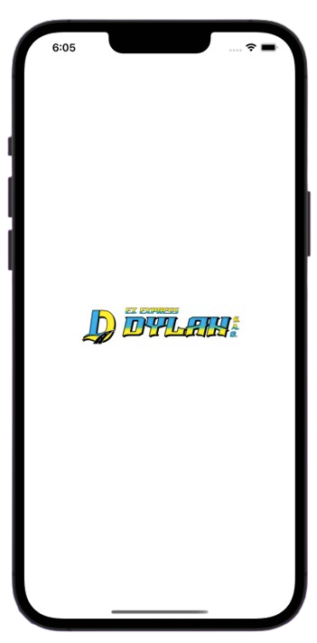
  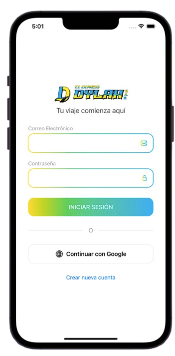
  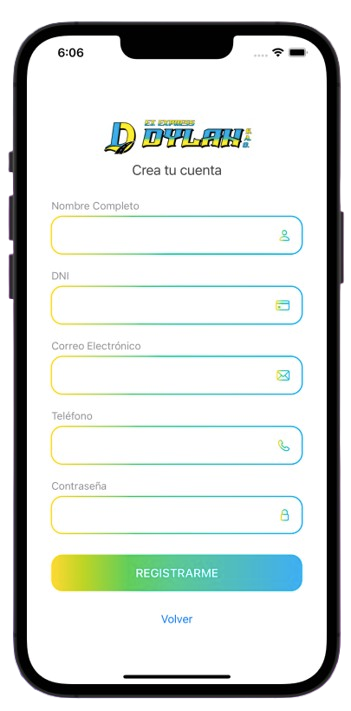
</p>

### Main Interface & Navigation
<p align="center">
  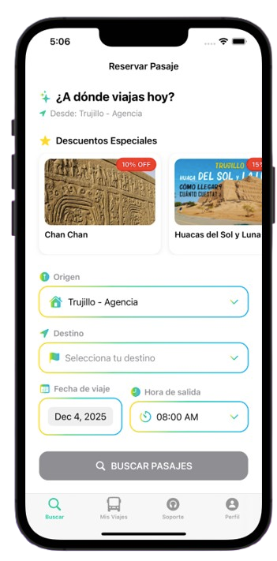
  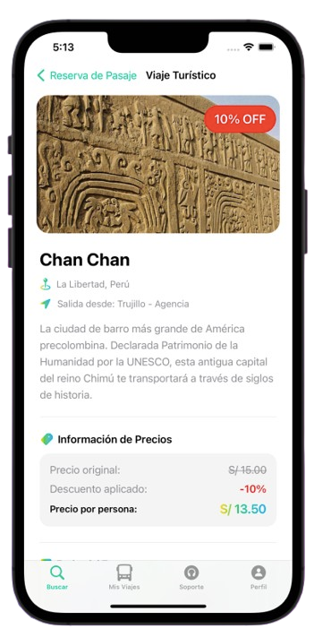
  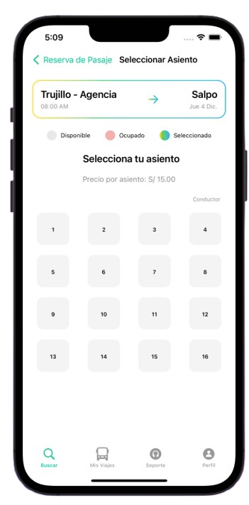
</p>

### Booking Experience
<p align="center">
  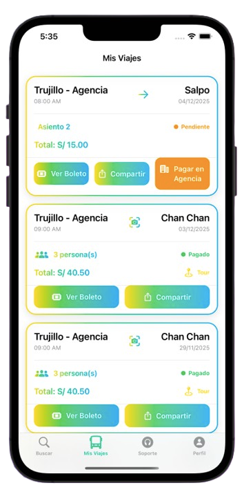
</p>

### Payment Methods
<p align="center">
  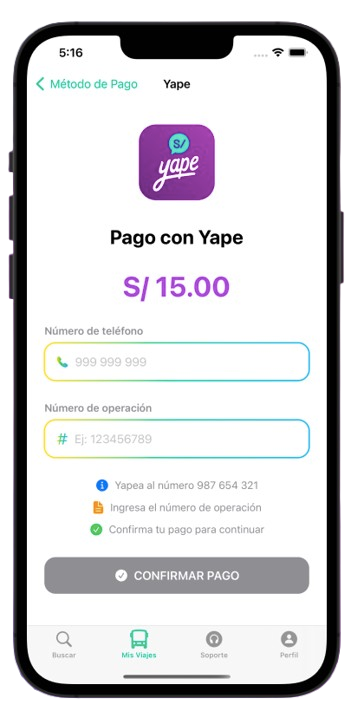
  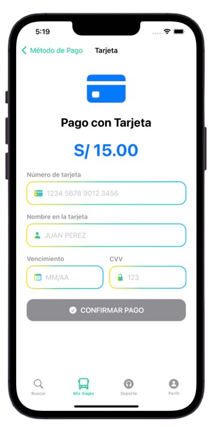
  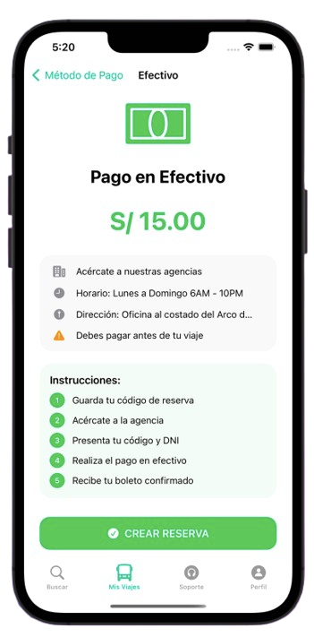
</p>

### User Services
<p align="center">
  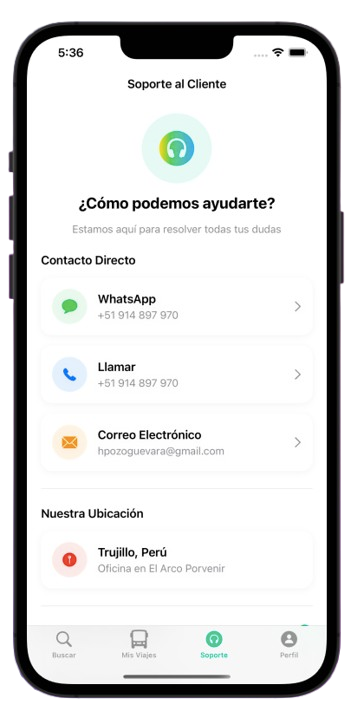
  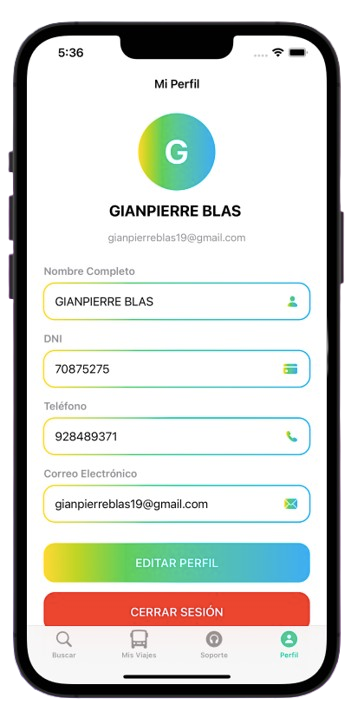
</p>

---

## 🎯 Project Impact

### Digital Transformation
Dylan Express represents a significant digital transformation initiative, bringing modern technology to traditionally underserved transportation sectors in Peru's highland regions.

### Key Objectives
- ✅ **Digitalize Operations** - Move from manual to automated booking systems
- ✅ **Reduce Wait Times** - Eliminate long queues at physical agencies
- ✅ **Real-time Updates** - Provide instant seat availability information
- ✅ **Tourism Promotion** - Showcase and preserve La Libertad's cultural heritage
- ✅ **Improve Accessibility** - Make transportation services available to everyone

### Social Impact
- **Community Connection** - Bridging urban-rural divides
- **Economic Development** - Supporting local tourism economies
- **Rural Accessibility** - Providing reliable transportation to remote areas
- **Cultural Preservation** - Promoting highland communities and traditions

---

## 👥 Target Audience

| User Segment | Needs & Benefits |
|-------------|------------------|
| **Local Residents** | Reliable daily transportation between Trujillo and rural communities |
| **Tourists** | Easy access to explore La Libertad's cultural and natural attractions |
| **Business Travelers** | Professional, punctual service for regional business needs |
| **Families** | Safe, comfortable travel for visiting relatives in highland areas |

---

## 🗺️ Development Roadmap

### ✅ Completed (Phase 1)
- [x] User authentication system with Firebase Auth
- [x] Comprehensive ticket search and booking functionality
- [x] Yape payment integration
- [x] QR code generation and validation
- [x] Tourism packages catalog and discovery
- [x] Push notification system
- [x] User profile management
- [x] Customer support integration

### 🚧 In Progress (Phase 2)
- [ ] Multi-language support (Spanish/English/Quechua)
- [ ] Apple Pay integration
- [ ] Offline booking capability
- [ ] Advanced analytics dashboard
- [ ] Rating and review system

### 🔮 Future Enhancements (Phase 3)
- [ ] AI-powered route recommendations
- [ ] Real-time vehicle tracking (GPS)
- [ ] In-app chat with drivers
- [ ] Loyalty rewards program
- [ ] Integration with other payment providers
- [ ] Augmented reality tourism guides
- [ ] Carbon footprint tracking

---

## 🧪 Testing

```bash
# Run unit tests
xcodebuild test -workspace DylanExpress.xcworkspace -scheme DylanExpress -destination 'platform=iOS Simulator,name=iPhone 15'

# Run UI tests
xcodebuild test -workspace DylanExpress.xcworkspace -scheme DylanExpressUITests -destination 'platform=iOS Simulator,name=iPhone 15'
```

### Code Coverage
- Target: 80% minimum coverage
- Current: [In Development]

---

## 🤝 Contributing

This is a private project. If you're interested in contributing or collaborating, please reach out directly.

### Development Guidelines
- Follow Swift API Design Guidelines
- Maintain comprehensive documentation
- Write unit tests for new features
- Follow MVVM architecture pattern
- Use SwiftLint for code consistency

---

## 📄 License

**Private & Proprietary** - All rights reserved.

This project is the intellectual property of Dylan Express and Gianpierre Blas. Unauthorized copying, distribution, or use is strictly prohibited.

---

## 👨‍💻 Developer

<div align="center">
  
  
  ### Gianpierre Blas
  **iOS Developer | Software Engineer**
  
  Passionate about creating impactful mobile solutions that bridge technology and social development.
  
  [](https://github.com/GIANPIERRE-BLAS)
  [](mailto:gianpierreblasflores235@gmail.com)
  [](tel:+51928489371)
  
</div>

---

## 📞 Contact

### Dylan Express Transportation

**Corporate Inquiries:**
- 📧 Email: gianpierreblasflores235@gmail.com
- 📱 Phone: +51 928 489 371
- 🌐 Website: [Coming Soon]
- 📍 Location: Trujillo, La Libertad, Peru

### For Support
- 💬 In-app customer support
- 📞 24/7 hotline available
- 💬 WhatsApp: +51 928 489 371

---

## 🙏 Acknowledgments

Special thanks to:
- The communities of La Libertad's highland regions
- Dylan Express transportation team
- Beta testers and early adopters
- Firebase and Apple developer communities

---

<div align="center">

**Made with ❤️ in Trujillo, La Libertad, Peru**

*Connecting Communities • Empowering Tourism • Building Futures*


---

© 2024 Dylan Express. All Rights Reserved.

</div>
